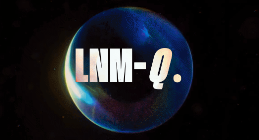

<!-- PROJECT SHIELDS -->
[![Contributors][contributors-shield]][contributors-url]
[![Forks][forks-shield]][forks-url]
[![Stargazers][stars-shield]][stars-url]
[![Issues][issues-shield]][issues-url]
[![MIT License][license-shield]][license-url]

<!-- PROJECT LOGO -->
 

  

  <strong>
    <h3 align="center" >LNM-Q</h3>
  </strong>
  

    <strong>
      GET CONNECTING
    </strong>
     
    <a href="https://github.com/Tushars815/LNM-Q_v1.3"><strong>Explore the project »</strong></a>
     
     
    <a href="https://lnm-q-v1-3.vercel.app/login">View Demo</a>
    ·
    <a href="https://github.com/Tushars815/LNM-Q_v1.3/issues">Report Bug</a>
    ·
    <a href="https://github.com/Tushars815/LNM-Q_v1.3/issues">Request Feature</a>
  

---

## About The Project

- A SAAS product to _connect college graduates, alumni, and faculty_ to revive the college culture and foster a more connected and engaged community.

---

### Built With

- [React](https://react.dev/learn)
- [MongoDB](https://www.mongodb.com/)
- [Express](https://expressjs.com/)
- [NodeJS](https://nodejs.org/en)

Written in JavaScript ♥

---

## License

Distributed under the MIT License. See [`LICENSE`][license-url] for more information.

---

## Contributors ✨

[**Sahil Sidana**](https://github.com/Sahil-Sidana)   
[**Rajdeep Tiwari**](https://github.com/RajdeepTiwari-24)   
[**Tushar Sharma**](https://github.com/Tushars815)

[contributors-shield]: https://img.shields.io/github/contributors/Tushars815/LNM-Q_v1.3.svg?style=for-the-badge
[contributors-url]: https://github.com/Tushars815/LNM-Q_v1.3/graphs/contributors
[forks-shield]: https://img.shields.io/github/forks/Tushars815/LNM-Q_v1.3.svg?style=for-the-badge
[forks-url]: https://github.com/Tushars815/LNM-Q_v1.3/network/members
[stars-shield]: https://img.shields.io/github/stars/Tushars815/LNM-Q_v1.3.svg?style=for-the-badge
[stars-url]: https://github.com/Tushars815/LNM-Q_v1.3/stargazers
[issues-shield]: https://img.shields.io/github/issues/Tushars815/LNM-Q_v1.3.svg?style=for-the-badge
[issues-url]: https://github.com/Tushars815/LNM-Q_v1.3/issues
[license-shield]: https://img.shields.io/github/license/Tushars815/LNM-Q_v1.3.svg?style=for-the-badge
[license-url]: https://github.com/Tushars815/LNM-Q_v1.3/blob/main/LICENSE.md
